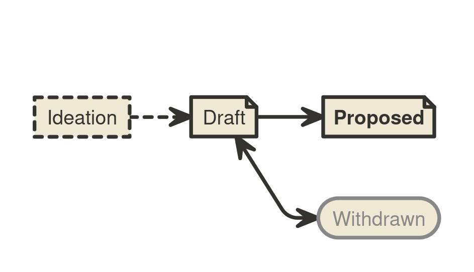

```
BIP: ?
Title: Updated BIP Process
Author: Murch <murch@murch.one>
Comments-URI: https://github.com/bitcoin/bips/wiki/Comments:BIP-Updated-BIP-Process
Status: Draft
Type: Process
Created: 2024-05-13
License: CC0-1.0
Replaces: 2
```

## tk: More input requested on following open questions

- Should we have a Final and/or Active Status?
- Should we add a mandatory Change Log section to BIPs?
- Should we introduce versioning/revisions to (final) BIPs?

## Abstract

A _Bitcoin improvement proposal (BIP)_ provides a concise, self-contained, technical description of one new concept,
feature, standard, implementation guideline, best-practice, or incident report (e.g. [BIP 50](bip-0050.mediawiki)
relevant to the Bitcoin community.

BIPs are intended to be the primary mechanism for proposing new protocol features, coordinating client standards, and
documenting design decisions that have gone into Bitcoin implementations. Each BIP is primarily owned by its authors,
the _BIP champions_[^champ], and represents the champions’ opinion or recommendation. The champions are expected to foster
discussion, address feedback and dissenting opinions, and, if applicable, advance adoption of their proposal within the
Bitcoin community.

The BIPs repository serves as a highly visible platform to put forward mature proposals. The repository’s visibility
facilitates the distributed consideration of proposals by establishing the current state of the proposal. The
repository’s versioning of the text-based BIPs retains the historical record of each proposal.
The BIPs repository does not[^acceptance] aim to track acceptance, adoption, or community consensus on BIPs except to facilitate a
quick overview of various BIPs’s statuses to repository visitors.

This BIP replaces BIP 2 with a more well-defined and clear process, and may be amended to address future needs of the
BIP process.

## What is a BIP?

### What is the significance of BIPs?

Individual BIPs do not represent Bitcoin community consensus or a general recommendation for implementation. A BIP
represents a personal recommendations by the BIP champions to the Bitcoin community. Some BIPs may be adopted by one or
multiple implementations or even incorporated into the Bitcoin protocol.

### What should be documented in a BIP?

The BIPs repository collects any proposals relevant to the Bitcoin community.

OR:

The BIPs repository is focused on information and technology that supports the bitcoin currency.[^astroturfing]

## BIP format and structure

### Specification

BIPs should be written in mediawiki or markdown format.

Each BIP should have the following parts:

* Preamble -- Headers containing metadata about the BIP (see the section [BIP header preamble](#bip-header-preamble)
  below).
* Abstract -- A short (~200 word) description of the technical issue being addressed.
* Motivation -- The motivation is critical for BIPs. It should clearly explain what issue the BIP addresses, and how the
  existing situation is inadequate to address the problem that the BIP solves.
* Specification -- The technical specification should describe the syntax and semantics of any new feature. The
  specification should be detailed enough to enable any Bitcoin project to create an interoperable implementation.
* Rationale -- The rationale fleshes out the specification by describing what motivated the design and why particular
  design decisions were made. It should describe alternate designs that were considered and related work. The rationale
  should address important objections or concerns raised during discussion.
* Backwards compatibility -- BIPs must include a section describing any backwards incompatibilities and their severity.
  The BIP must explain how implementors/users should deal with these incompatibilities.
* Reference implementation -- Where applicable, a reference implementation, test vectors and documentation must be
  completed before the BIP can be given status "Nominated". Any or all of these can be provided either in the BIP or as
  auxiliary files. It is recommended to focus on specification and rationale before writing code.
* Change Log -- An optional section to track modifications to a BIP after reaching Nominated status.
* Footnotes -- A collection of footnotes cited in the BIP, and a place to list non-inline hyperlink targets
* Copyright -- The BIP must be placed under an acceptable license ([see BIP Licensing below](#bip-licensing)).

Some sections may not be necessary for all BIPs. When in doubt, a section should be included and briefly state how its
topic has been sufficiently addressed.

#### BIP header preamble

Each BIP must begin with an RFC 822 style header preamble. The headers must appear in the following order. Headers
marked with "\*" are optional. All other headers are required.

```
  BIP: <BIP number, or "?" before being assigned>
* Layer: <Consensus (soft fork) | Consensus (hard fork) | Peer Services | API/RPC | Applications>
  Title: <BIP title; maximum 44 characters>
  Champions: <list of champions’ names and email addresses>
  Status: <Draft | Nominated | Active | Abandoned>
  Type: <Standards Track | Informational | Process>
  Created: <date created on, in ISO 8601 (yyyy-mm-dd) format>
  License: <abbreviation for approved license(s)>
* License-Code: <abbreviation for code under different approved license(s)>
* Post-History: <list of mailing list threads, or other noteworthy discussions in "date: link" format>
* Requires: <BIP number(s)>
* Replaces: <BIP number>
* Superseded-By: <BIP number>
```

__BIP__: BIP number, or "?" before a number was assigned. Champions must not self-assign numbers. Numbers are assigned
by BIP Editors.

__Layer__: The Layer header documents which layer of Bitcoin the BIP applies to. See [BIP 123](bip-0123.mediawiki) for
definitions of the various BIP layers.

__Champions__: The champions header lists the names and email addresses of the current owners of the BIP. This may or
may not be the original authors of the BIP. The format of each champion header value must be

    Random J. User <address@dom.ain>

If there are multiple champions, each should be on a separate line following [RFC
2822](https://datatracker.ietf.org/doc/html/rfc2822.html) continuation line conventions [tk: what is the convention?].

__Type__: The Type header specifies the type of BIP: Standards Track, Informational, or Process.

__Created__: The Created header records the date that the BIP was assigned a number. [tk: for reals?! What should that
date be?]

__Post-History__: Post-History is used to record when new versions of the BIP are posted to bitcoin mailing lists. Dates
should be in yyyy-mm-dd format, e.g. 2001-08-14. Post-History is permitted to be a link to a specific thread in a
mailing list archive.

__Requires__: BIPs may have a Requires header, indicating the BIP numbers that this BIP depends on.

__Replaces/Superseded-By__: BIPs may have a Superseded-By header indicating that a BIP has been rendered obsolete by a
later document; the value is the number of the BIP that replaces the current document. The newer BIP must have a
Replaces header containing the number of the BIP that it rendered obsolete.

#### Auxiliary Files

BIPs may include auxiliary files such as diagrams. Auxiliary files must be included in a subdirectory for that BIP named
`bip-XXXX`, where "XXXX" is the BIP number. File names in the subdirectory do not need to adhere to a specific
convention.

### BIP types

* A **Standards Track BIP** describes any change that affects most or all Bitcoin implementations, such as a change to the
  network protocol, a change in block or transaction validity rules, or any change or addition that affects the
  interoperability of applications using Bitcoin. Standards Track BIPs consist of two parts, a design document and a
  reference implementation.
* An **Informational BIP** describes a Bitcoin design issue, provides general guidelines, or information to the Bitcoin
  community, but does not propose a new feature. Informational BIPs do not necessarily represent a Bitcoin community
  consensus or recommendation, so users and implementors are free to ignore Informational BIPs or follow their advice.
* A **Process BIP** describes a process surrounding Bitcoin, or proposes a change to (or an event in) a process. Process
  BIPs are like Standards Track BIPs, but apply to areas other than the Bitcoin protocol itself. They may propose an
  implementation, but not to Bitcoin's codebase; they often require community consensus; unlike Informational BIPs, they
  are more than recommendations, and users are typically not free to ignore them. Examples include procedures,
  guidelines, and changes to the decision-making process. Any meta-BIP is also considered a Process BIP.

## Workflow

The BIP process starts with a new idea for Bitcoin. Each potential BIP must have a champion (or multiple
champions)—someone who authors the BIP, gathers feedback, shepherds the discussion in the appropriate forums, and
finally recommends a mature proposal to the community.



### Ideation

After having an idea, the champion should evaluate whether it is BIP-able. The idea must be of interest to the broader
community or relevant to multiple software projects. Small improvements and matters concerning only a single project
usually do not require standardization and should instead be brought up to the relevant project directly.

The champion should first research whether an idea has been considered before. Ideas in Bitcoin are often rediscovered,
and prior related discussions may inform the author what issues may arise in its progression. After some investigation,
the novelty of an idea can be tested by posting about it to the [Bitcoin development mailing
list](https://groups.google.com/g/bitcoindev).

Vetting an idea publicly before investing the time to formally describe the idea is meant to save both the champion and
the broader community time. Not only may someone point out relevant discussion topics that were missed in the champion’s
research, or that an idea is guaranteed to be rejected based on prior discussions, but describing an idea publicly also
tests whether it is of interest to more people beside the champion. After establishing that the idea may be of interest
to the Bitcoin community, the champion should work on drafting a BIP.

It is highly recommended that a single BIP contain a single key proposal or new idea. The more focused the BIP, the more
successful it tends to be. If in doubt, split your BIP into several well-focused ones.

### Progression through BIP Statuses

As the first draft is taking shape, the champion should present it to the [Bitcoin development mailing
list](https://groups.google.com/g/bitcoindev). This gives the champion a chance to collect initial feedback and address
fundamental concerns. If the champion wishes to work in public on the draft at this stage, it is recommended that they
open a pull request against their personal fork of the BIPs repository instead of the main BIPs repository.

The following sections refer to BIP Status Field values. The BIP Status Field is defined in the Header Preamble
specification below.

#### Draft

After fleshing out the draft further and ensuring that it is of high quality and properly formatted, the champion should
open a pull request to the [BIPs repository](https://github.com/bitcoin/bips). The draft BIP must adhere to the
formatting requirements specified below and named with a working title of the form "bip-authorname-topicofproposal". The
champion must not self-assign a number to the BIP draft.

BIPs that (1) adhere to the formatting requirements, (2) are on-topic, and (3) have materially progressed beyond the
ideation phase, e.g. by generating substantial public discussion and commentary from diverse contributors, by
independent Bitcoin projects working on adopting the proposal, or by the champion working for an extended period of time
towards improving the proposal based on community feedback, will be assigned a number by a BIP editor.
The BIP editors should delay number assignment when they perceive a BIP draft being met with comprehensive lack of
interest: number assignment facilitates the distributed discussion of ideas, but before a BIP garners some interest of
the Bitcoin community, there is no need to refer to it by a number.

BIP drafts are also not ready for number assignment if they duplicate efforts, disregard formatting rules, are too
unfocused or too broad, fail to provide proper motivation, fail to address backwards compatibility, or when the proposed
feature’s specification is unclear or incomplete. Reviewers and BIP editors should provide guidance on how the draft may
be improved to progress towards readiness. Pull requests that are proposing off-topic or unserious proposals, or have
stopped to make progress may be closed.

When the BIP draft is complete, a BIP editor will assign a BIP type (see below), and merge it to the BIPs repository.
After the BIP is merged to the repository, its main focus should no longer shift significantly, even while the champion
may continue to update the draft as necessary in the git repository. Updates to drafts by the champion should also be
submitted as pull requests.

#### Nominated[^nominated]

When the champion is confident that their BIP represents a net-improvement, is
clear, comprehensive, has a working reference implementation (if applicable),
and is ready for adoption by the Bitcoin community, they may update the BIP’s
status to Nominated to indicate that they recommend adoption or implementation
of the BIP. Where applicable, the champion must ensure that any proposed
specification is solid, not unduly complicated, and definitive. Subsequently, a
BIP’s content should only be adjusted in minor details, e.g. to improve language, clarify ambiguities, backfill
omissions in the specification, add test vectors for edge-cases, or address other issues discovered as the BIP is
adopted.

As time passes, substantial changes or changes that interfere with existing implementations are increasingly heavily
discouraged.

A Nominated BIP can only transition to Active or to Abandoned. If a Nominated BIP is found to need substantial
functional changes, it should be moved to Abandoned and a new BIP should be drafted instead.

#### Active

At the earliest three months after a BIP has been moved to Nominated, a BIP may be advanced to Active upon request of
any community member by providing evidence that the idea described in the BIP is in active use. Such evidence includes
for example: two or more projects having deployed support for the BIP in mainnet software releases, a soft fork
proposal’s activation criteria having been met on the network, or rough consensus for the BIP having been demonstrated.

At that point, the BIP should be considered final and any breaking changes to the BIP should be proposed as a new
separate BIP.

##### Process BIPs

A process BIP may change status from Nominated to Active when it achieves rough consensus on the mailing list. Such a
proposal is said to have rough consensus if it has been open to discussion on the development mailing list for at least
one month, and no person maintains any unaddressed substantiated objections to it. Addressed or obstructive objections
may be ignored/overruled by general agreement that they have been sufficiently addressed, but clear reasoning must be
given in such circumstances. An Active Process BIP may be modified indefinitely as long as a proposed modification
has rough consensus per the same criteria.

##### Revisions

Any changes to a BIP after it has transitioned to Nominated or Active are tracked with date and description in a
Change Log section.

#### Abandoned[^abandoned]

A BIP may be labeled Abandoned when its champion has stopped working on it, no longer pursues adoption of their complete
proposal, or no longer recommends the proposed approach, AND the BIP is not in active use.

BIP champions may decide on their own to change their BIP’s status from Draft to Abandoned.

BIPs with the status Nominated can be moved to Abandoned after a champion announces this transition to the
Bitcoin Developer Mailing List and is not opposed within 14 days. One of the opposers must become the new BIP champion
for the BIP to remain Nominated. A BIP can also be transitioned to Abandoned by BIP Editors, if it is not in active
use, its champion has become unresponsive and no new champion volunteers within four weeks.

A BIP may be transitioned from Active to Abandoned when it is no longer in active use. Any community member may
initiate this transition by announcing it to the mailing list and no objections being raised for four weeks.

### Adoption of proposals

The BIPs repository does not track the sentiment on proposals and does not track the adoption of BIPs beyond whether
they are in active use or not. It is not intended for BIPs to list additional implementations beyond the reference
implementation.[^OtherImplementations] After a BIP is advanced to Nominated, it is up to the Bitcoin community to
evaluate, adopt, ignore, or repudiate a BIP. Individual Bitcoin projects are encouraged to publish a list of BIPs they
implement. A good example of this at the time of writing this BIP can be observed in [Bitcoin Core’s doc/bips.md
file](https://github.com/bitcoin/bitcoin/blob/master/doc/bips.md).

### Transferring BIP Ownership

It occasionally becomes necessary to transfer ownership of BIPs to a new champion. In general, we would like to retain
the original author as a co-author of the transferred BIP, but that is up to the original author. A good reason to
transfer ownership is because the original author no longer has the time or interest in updating it or following through
with the BIP process, or has fallen off the face of the 'net (i.e. is unreachable or not responding to email). A bad
reason to transfer ownership is because you don't agree with the direction of the BIP. We try to build consensus around
a BIP, but if that's not possible, you can always submit a competing BIP.

If you are interested in assuming ownership of a BIP, send a message asking to take over, addressed to both the original
author and the BIP editors. If the original author does not respond to email in a timely manner, the BIP editors will
make a unilateral decision (it's not like such decisions can't be reversed :)).

## BIP Licensing

### Specification

New BIPs may be accepted with the following licenses. Each new BIP must identify at least one acceptable license in its
preamble. The License header in the preamble must be placed after the Created header. Each license must be referenced by
their respective abbreviation given below.

For example, a preamble might include the following License header:

    License: CC0-1.0
             GNU-All-Permissive

In this case, the BIP text is fully licensed under both the Creative Commons CC0 1.0 Universal license as well as the
GNU All-Permissive License, and anyone may modify and redistribute the text provided they comply with the terms of
*either* license. In other words, the license list is an "OR choice", not an "AND also" requirement.

It is also possible to license source code differently from the BIP text. An optional License-Code header is placed
after the License header. Again, each acceptable license must be referenced by their respective abbreviation given
below.

For example, a preamble specifying the optional License-Code header might look like:

    License:         CC0-1.0
    License-Code:    MIT

In this case, the code in the BIP is not available under CC0-1.0, but is only available under the terms of the MIT
License.

BIPs are not required to be *exclusively* licensed under approved terms, and may also be licensed under unacceptable
licenses *in addition to* at least one acceptable license. In this case, only the acceptable license(s) should be listed
in the License and License-Code headers. It is recommended that BIPs are made available under at least one license
that is not a software license[^licenses].

It is recommended that BIPs that include literal code be dual-licensed under the same license terms as the project it
modifies. For example, literal code intended for Bitcoin Core would ideally be dual-licensed under the MIT license terms
as well as one of the above with the rest of the BIP text.

In all cases, details of the licensing terms must be provided in the Copyright section of the BIP.

#### Recommended license

* CC0-1.0: [Creative Commons CC0 1.0 Universal](https://creativecommons.org/publicdomain/zero/1.0/)
* GNU-All-Permissive: [GNU All-Permissive License](http://www.gnu.org/prep/maintain/html_node/License-Notices-for-Other-Files.html)

#### Not recommended, but acceptable licenses

* BSD-2-Clause: [OSI-approved BSD 2-clause license](https://opensource.org/licenses/BSD-2-Clause)
* BSD-3-Clause: [OSI-approved BSD 3-clause license](https://opensource.org/licenses/BSD-3-Clause)
* CC-BY-4.0: [Creative Commons Attribution 4.0 International](https://creativecommons.org/licenses/by/4.0/)
* CC-BY-SA-4.0: [Creative Commons Attribution-ShareAlike 4.0 International](https://creativecommons.org/licenses/by-sa/4.0/)
* MIT: [Expat/MIT/X11 license](https://opensource.org/licenses/MIT)

#### Not acceptable licenses

All licenses not explicitly included in the above lists are not acceptable terms for a Bitcoin Improvement Proposal.
However, BIPs predating the acceptance of this BIP were allowed under other terms, and should use these abbreviation
when no other license is granted:

* PD: Released into the public domain
* OPL: [Open Publication License, version 1.0](http://opencontent.org/openpub/)

## BIP Editors

The current BIP editors are:

* Bryan Bishop ([kanzure@gmail.com](mailto:kanzure@gmail.com))
* Jon Atack ([jon@atack.com](mailto:jon@atack.com))
* Luke Dashjr ([luke_bipeditor@dashjr.org](mailto:luke_bipeditor@dashjr.org))
* Mark "Murch" Erhardt ([murch@murch.one](mailto:murch@murch.one))
* Olaoluwa Osuntokun ([laolu32@gmail.com](mailto:laolu32@gmail.com))
* Ruben Somsen ([rsomsen@gmail.com](mailto:rsomsen@gmail.com))

### BIP Editor Responsibilities & Workflow

The BIP editors subscribe to the Bitcoin development mailing list and watch the [BIPs
repository](https://github.com/bitcoin/bips).
Off-list BIP-related correspondence should be sent (or CC'd) to the BIP editors.

When a new BIP idea is submitted to the mailing list, BIP editor and other community members should comment in regard
to:

* Novelty of the idea
* Viability, utility, and relevance of the concept
* Readiness of the draft
* On-topic for the Bitcoin community

If the BIP is not ready, an editor should ensure that constructive, actionable feedback is provided to the champion for
revision. Once the BIP is ready it should be submitted as a "pull request" to the [BIPs
repository](https://github.com/bitcoin/bips) where it may get further feedback.

For each new BIP draft pull request that comes in, an editor checks the following:

* Draft has been previously discussed on the Bitcoin development mailing
* Title accurately describes the content
* Proposal is of general interest and/or pertains to more than one Bitcoin project/implementation
* Document is properly formatted
* Licensing terms are acceptable
* Motivation, Rationale, and Backwards Compatibility have been addressed (where applicable)
* The defined Layer header must be correctly assigned for the given specification
* The BIP is ready: it is complete, comprehensible, and technically feasible

Editors do NOT evaluate whether the proposal is likely to be adopted.

A BIP editor will:

* Assign a BIP number in the pull request
* Merge the pull request when it is ready
* List the BIP in the [README](README.mediawiki)

The BIP editors are intended to fulfill administrative and editorial responsibilities. The BIP editors monitor BIP
changes, and update BIP headers as appropriate.

BIP editors may also, at their option, unilaterally make and merge strictly-editorial changes to BIPs, such as
correcting misspellings, fixing broken links, etc. as long as they do not change the meaning or conflict with the
original intent of the author.

## Changes from BIP-2

- Refer to the proponent of a BIP as "Champion"
- Status field is no longer modeled around the workflow of consensus changes. The only remaining status are DRAFT,
  NOMINATED, ACTIVE, and ABANDONED. The statuses Deferred, Final, Obsolete, Proposed, Rejected, Replaced, and Withdrawn
  are sunset.
- BIPs can no longer be rejected due to inactivity, but BIPs that get no adoption whose champion has become unreachable can be moved to Abandoned
- Judgment calls required from BIP Editors are mostly reassigned either to the audience or the BIP champion
- Tracking of adoption, acceptance, and community consensus is out of scope for the BIPs repository
- Layer header is no longer restricted to Standards Track
- Auxiliary files are only permitted in the corresponding BIP’s subdirectory as nobody used the alternative of labeling
  them with the BIP number
- The Comments-URI and Comment-Summary headers are dropped from the preamble, Comments as an aspect of the process are
  discontinued[^comments]
- The Discussions-To header is dropped, as it has never been used
- List of acceptable licenses was reduced to the ones previously used
- "Other Implementations" sections are discouraged

## Copyright

This BIP is licensed under the [CC0 1.0 Universal](https://creativecommons.org/publicdomain/zero/1.0/) license.

## Related Specifications

- [BIP 1: BIP Purpose and Guidelines](bip-0001.mediawiki)
- [BIP 2: BIP Process, revised](BIP-0002.mediawiki)
- [BIP 123: BIP Classification](BIP-0123.mediawiki)
* [RFC 7282: On Consensus and Humming in the IETF](https://tools.ietf.org/html/rfc7282)

## Rationale

[^astroturfing]: **What does it mean to be focused on Bitcoin the currency?**  
    Proposals to astroturf on the Bitcoin network to store data, bootstrap their own consensus mechanism, or facilitate
    another currency are not on-topic.
[^comments]: **Why were comments, Comments-URI, and Comment-Summary removed from the process?**  
    The comments feature saw marginal use. Hardly any BIPs received more than two comments and this led to many
    situations in which the opinion of a single comment or two commenters ended up sourcing the comment summary. While
    some of those comments may have been representative of broadly held opinions, it also overstated the importance of
    individual comments. As collecting feedback in this accessible fashion failed, the new process puts the onus back on
    the audience to make their own evaluation.
[^OtherImplementations]: **What is the issue with "Other Implementations" sections in BIPs?**  
    In the past, some BIPs had "Other Implementations" sections that caused frequent change requests to existing BIPs.
    This put an onus on the BIP champions, and frequently lead to lingering pull requests due to the corresponding BIPs’
    champions no longer participating in the process. Many of these alternative implementations eventually became
    unmaintained or were low-quality to begin with. Therefore, "Other Implementations" sections are heavily discouraged.
[^champ]: **Why do we prefer 'Champion' over 'Author'?**  
    Sometimes BIP authors discontinue work on BIPs or leave Bitcoin development. In that case another proponent may
    adopt the BIP as a new owner, even if they are not the original author.
[^nominated]: **Why has the Proposed Status been renamed to Nominated?**  
    Some reviewers of this BIP brought up that all Bitcoin Improvement _Proposals_ are _proposed_ per se. Therefore, a
    new name was chosen.
[^abandoned]: **Why was the Abandoned Status introduced?**  
    Previously, we had Deferred, Obsolete, Rejected, Replaced, and Withdrawn which all meant some flavor of "work has
    stopped on this". The author of this BIP feels that all of these can be represented by Abandoned.
[^acceptance]: **Why does the BIPs repository no longer track adoption?**  
    BIP 2 made an attempt to gather community feedback into summaries in BIPs directly. Given the low adoption and
    corresponding low information quality of the summaries that resulted from that feature, this BIP instead intends to
    leave the evaluation of BIPs to the audience.
[^licenses]: **Why were software licenses removed from recommended licenses and other licenses dropped?**  
    Among the 141 BIPs with licenses in the repository, only nine licenses have ever been used to license BIPs (although,
    some BIPs were made available under more than one license) and only one license has been used to license code:

    Licenses used:

    * BSD-2-Clause: 55
    * PD: 42
    * CC0-1.0: 23
    * BSD-3-Clause: 19
    * OPL: 5
    * CC-BY-SA-4.0: 4
    * GNU-All-Permissive: 3
    * MIT: 2
    * CC-BY-4.0: 1

    License-Code used:

    * MIT: 4

    The following previously acceptable licenses have been dropped, because they have never been used in the BIPs process:

    * AGPL-3.0+: [GNU Affero General Public License (AGPL), version 3 or newer](http://www.gnu.org/licenses/agpl-3.0.en.html)
    * Apache-2.0: [Apache License, version 2.0](http://www.apache.org/licenses/LICENSE-2.0)
    * BSL-1.0: [Boost Software License, version 1.0](http://www.boost.org/LICENSE_1_0.txt)
    * FDL-1.3: [GNU Free Documentation License, version 1.3](http://www.gnu.org/licenses/fdl-1.3.en.html)
    * GPL-2.0+: [GNU General Public License (GPL), version 2 or newer](http://www.gnu.org/licenses/old-licenses/gpl-2.0.en.html)
    * LGPL-2.1+: [GNU Lesser General Public License (LGPL), version 2.1 or newer](http://www.gnu.org/licenses/old-licenses/lgpl-2.1.en.html)

    Some of the previously recommended licenses explicitly state that they apply to software, but BIPs are foremost text
    documents. As such, the previously recommended BSD-[2|3]-Clause licenses that only apply to software have been moved to
    the "Not recommended" section. This leaves us with only the CC0-1.0 and the GNU-All-Permissive licenses as recommended.

    Why are there software licenses included?

    * Some BIPs, especially concerning the consensus layer, may include literal code in the BIP itself which may not be
      available under the exact license terms of the BIP.
    * Despite this, not all software licenses would be acceptable for content included in BIPs.

    Why are OPL and Public Domain no longer acceptable for new BIPs?

    * Public domain is not universally recognised as a legitimate action, thus it is inadvisable
    * The OPL is generally regarded as obsolete, and not a license suitable for new publications
