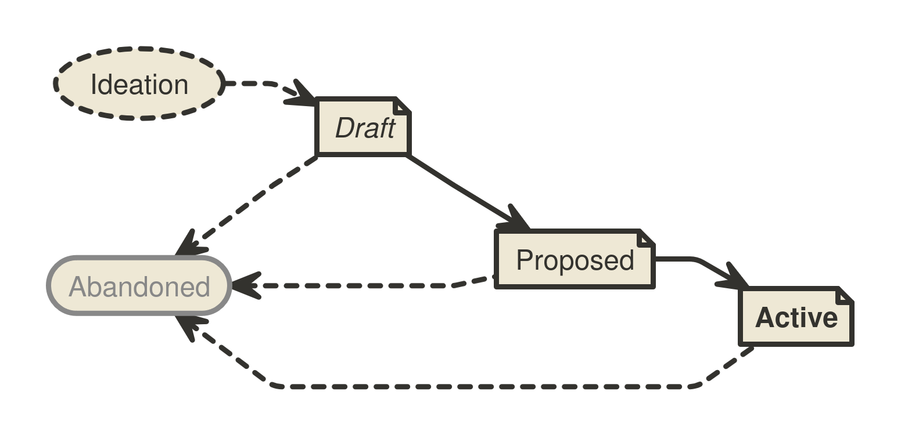

```
BIP: ?
Title: Updated BIP Process
Author: Murch <murch@murch.one>
Comments-URI: https://github.com/bitcoin/bips/wiki/Comments:BIP-Updated-BIP-Process
Status: Draft
Type: Process
Created: 2024-05-13
License: BSD-2-Clause
Requires: 123
Replaces: 2
```

## Abstract

This _Bitcoin Improvement Proposal (BIP)_ provides information about the preparation of BIPs and policies relating to
the publication of BIPs. It replaces BIP 2 with a streamlined process, and may be amended in the future to address the
evolving needs of the BIP process.

The BIPs repository serves as a publication medium and archive for mature proposals. The repository’s visibility
facilitates the distributed consideration of BIPs by providing an established source to retrieve the latest versions of
BIPs. The repository transparently records all changes to each BIP and allows any community member to easily retain a
complete copy of the archive.

The BIPs repository does not aim to track acceptance[^acceptance], adoption, or community consensus on BIPs except to
provide a quick overview of BIP statuses (see [Workflow](#workflow) below) to visitors.

## Motivation

BIP 2 is over eight years old and was written when different concerns were pressing to the Bitcoin community. The BIP 2
process seems to have been fashioned to facilitate design and activation of protocol changes. In the past years, BIPs
more often describe interoperable features beyond the base protocol. We have had multiple debates about the role of
BIP Editors, and some aspects of the process specified by BIP 2 that did not seem to achieve the intended goal. This
proposal sunsets aspects of the BIP 2 process that did not achieve broad adoption, reduces the judgment calls assigned
the BIP Editor role, and delineates the BIP Types more expediently.

## What is a BIP?

BIPs cover the range of interests of the Bitcoin community. The main topic is technology that supports the bitcoin
currency. Most BIPs provide a concise, self-contained, technical description of one new concept, feature, or standard.
Some BIPs describe processes, implementation guidelines, best practices, incident reports (e.g.
[BIP 50](bip-0050.mediawiki)), or other information relevant to the Bitcoin community. However, any topics related to
the Bitcoin protocol, Bitcoin’s P2P network, and Bitcoin client software may be acceptable.

BIPs are intended to be the primary mechanism for proposing new protocol features, coordinating client standards, and
documenting design decisions that have gone into implementations. Each BIP is primarily owned by its authors, and
represents the authors’ opinion or recommendation. The authors are expected to foster discussion, address feedback and
dissenting opinions, and, if applicable, advance adoption of their proposal within the Bitcoin community. BIPs may be
submitted by anyone.

### What is the significance of BIPs?

BIPs do not define what Bitcoin is: individual BIPs do not represent Bitcoin community consensus or a general
recommendation for implementation. A BIP represents a personal recommendation by the BIP author to the Bitcoin
community. Some BIPs may never be adopted. Some BIPs may be adopted by several implementations. Some may even be
incorporated into the Bitcoin protocol.

### What is the scope of the BIPs repository?

The BIPs repository is focused on information and technologies that aim to support and expand the utility of the bitcoin
currency. Related topics that are of interest to the Bitcoin community may be acceptable. Proposals that are in direct
contradiction to this mission, e.g. by undermining fungibility, facilitating unrelated protocols, using Bitcoin for data
storage, or hobbling mining decentralization, may be considered out-of-scope.

## BIP format and structure

### Specification

BIPs should be written in mediawiki or markdown[^markdown] format.

Each BIP must have a Preamble, an Abstract, a Copyright section, and a Backwards Compatibility section. Authors should
consider all issues in the following list and address each as appropriate. For some BIPs, some concerns may not warrant
a dedicated section.

* Preamble -- Headers containing metadata about the BIP (see the section [BIP header preamble](#bip-header-preamble)
  below).
* Abstract -- A short description of the technical issue being addressed.
* Motivation -- The motivation is critical for BIPs. It should clearly explain what issue the BIP addresses, and how the
  existing situation is inadequate to address the problem that the BIP solves.
* Specification -- The technical specification should describe the syntax and semantics of any new feature. The
  specification should be detailed enough to enable any Bitcoin project to create an interoperable implementation.
* Rationale -- The rationale fleshes out the specification by describing what motivated the design and why particular
  design decisions were made. It should describe alternate designs that were considered and related work. The rationale
  should address important objections or concerns raised during discussion.
* Backwards compatibility -- BIPs must include a section describing any backwards incompatibilities and their severity.
  The BIP must explain how implementers/users should deal with these incompatibilities.
* Reference implementation -- Where applicable, a reference implementation, test vectors and documentation must be
  completed before the BIP can be given status "Preliminary". Any or all of these can be provided either in the BIP or as
  auxiliary files. It is recommended to focus on specification and rationale before writing code.
* Change Log -- A section to track modifications to a BIP after reaching Preliminary status.
* Copyright -- The BIP must be placed under an acceptable license ([see BIP Licensing below](#bip-licensing)).

#### BIP header preamble

Each BIP must begin with an RFC 822 style header preamble. The headers must appear in the following order. Headers
marked with "\*" are optional. All other headers are required. The overview is followed by explanations for each header.

```
  BIP: <BIP number, or "?" before being assigned>
* Layer: <Consensus (soft fork) | Consensus (hard fork) | Peer Services | API/RPC | Applications>
  Title: <BIP title, up to 50 characters>
  Author: <list of authors’ names and email addresses>
  Status: <Draft | Preliminary | Active | Abandoned>
  Type: <Specification | Informational | Process>
  Created: <date the BIP was assigned a number, in ISO 8601 (yyyy-mm-dd) format>
  License: <SPDX License Identifier of approved license(s)>
* License-Code: <SPDX License Identifier for Code under different approved license(s)>
* Discussion: <list of mailing list threads, or other noteworthy discussions in "date: link" format>
* Requires: <BIP number(s)>
* Replaces: <BIP number>
* Superseded-By: <BIP number>
```

__BIP__: BIP number, or "?" before a number was assigned. The proposal must not self-assign a BIP number. Numbers are
assigned by BIP Editors.

__Layer__: The Layer header documents which layer of Bitcoin the BIP applies to. See [BIP 123](bip-0123.mediawiki) for
definitions of the various BIP layers.

__Title__: A short descriptive title. Strongly preferred to be less than 50 characters long.

__Author__: The author header lists the names (or pseudonyms) and email addresses of the current proponents of the BIP.
This may or may not be the original authors of the BIP. The format of each authors header value must be

    Random J. User <address@dom.ain>

If there are multiple authors, each should be on a separate line following [RFC
2822](https://datatracker.ietf.org/doc/html/rfc2822.html) continuation line conventions.

__Status__: The Status field can take the four values Draft, Preliminary, Active, and Abandoned. The
[Workflow](#workflow) section below describes the statuses in detail.

__Type__: The Type header specifies the type of BIP: Specification, Informational, or Process.

__Created__: The Created header records the date that the BIP was assigned a number.

__Discussion__: The Discussion header is used to point the audience to relevant discussions of the BIP, e.g. the mailing
list thread in which the idea for the BIP was discussed, a thread where a new version of the BIP draft was presented, or
relevant disussion threads on other platforms. Entries take the format "yyyy-mm-dd: link", e.g. `2009-09-09:
https://www.mail-archive.com/cryptography@metzdowd.com/msg10142.html`.

__License/License-Code__: See the [BIP Licensing](#bip-licensing) section below for a description of the
acceptable Licenses and their SPDX License Identifiers.

__Requires__: BIPs may have a Requires header to indicate existing BIPs the new proposal depends on.

__Replaces/Superseded-By__: BIPs may have a Superseded-By header indicating that a BIP has been rendered obsolete by a
later document; the value is the number of the BIP that replaces the current document. The newer BIP must have a
Replaces header containing the number of the BIP that it rendered obsolete.

#### Auxiliary Files

BIPs may include auxiliary files such as diagrams. Auxiliary files must be included in a subdirectory for that BIP named
`bip-XXXX`, where "XXXX" is the BIP number zero-padded to four digits. File names in the subdirectory do not need to adhere to a specific
convention.

### BIP types

* A **Specification BIP** defines a set of technical rules affecting the interoperability of implementations. The
  distinguishing feature of a Specification BIP is that it can be implemented, and implementations can be compliant with
  it. Specification BIPs should come with or refer to a reference implementation.
* An **Informational BIP** describes a Bitcoin design issue, provides general guidelines, or other information to the
  Bitcoin community.
* A **Process BIP** describes a process surrounding Bitcoin, or proposes a change to (or an event in) a process. Process
  BIPs are like Specification BIPs, but apply to areas other than the Bitcoin protocol itself. They may propose an
  implementation, but not to Bitcoin's codebase; they often require community consensus; unlike Informational BIPs, they
  are more than recommendations, and users are typically not free to ignore them. Examples include procedures,
  guidelines, and changes to the decision-making process.

## Workflow

The BIP process starts with a new idea for Bitcoin. Each potential BIP must have an author (or multiple
authors)—someone who writes the BIP, gathers feedback, shepherds the discussion in the appropriate forums, and
finally recommends a mature proposal to the community.



### Ideation

After having an idea, the author should evaluate whether it is meets the criteria to become a BIP, as described in
this BIP. The idea must be of interest to the broader community or relevant to multiple software projects. Small
improvements and matters concerning only a single project usually do not require standardization and should instead be
brought up to the relevant project directly.

The author should first research whether an idea has been considered before. Ideas in Bitcoin are often rediscovered,
and prior related discussions may inform the author what issues may arise in its progression. After some investigation,
the novelty of an idea can be tested by posting about it to the [Bitcoin development mailing
list](https://groups.google.com/g/bitcoindev).

Vetting an idea publicly before investing the time to formally describe the idea is meant to save both the author and
the broader community time. Not only may someone point out relevant discussion topics that were missed in the author’s
research, or that an idea is guaranteed to be rejected based on prior discussions, but describing an idea publicly also
tests whether it is of interest to more people beside the author. After establishing that the idea may be of interest
to the Bitcoin community, the author should work on drafting a BIP.

It is recommended that complicated proposals be split into separate BIPs that each focus on a specific component of the
overall proposal.

### Progression through BIP Statuses

As the first draft is taking shape, the author should present it to the [Bitcoin development mailing
list](https://groups.google.com/g/bitcoindev). This gives the author a chance to collect initial feedback and address
fundamental concerns. If the author wishes to work in public on the draft at this stage, it is recommended that they
open a pull request against their personal fork of the BIPs repository instead of the main BIPs repository.

The following sections refer to BIP Status Field values. The BIP Status Field is defined in the Header Preamble
specification below.

#### Draft

After fleshing out the draft further and ensuring that it is of high quality and properly formatted, the author should
open a pull request to the [BIPs repository](https://github.com/bitcoin/bips). The draft BIP must adhere to the
formatting requirements specified below and named with a working title of the form "bip-title". The author must not
self-assign a number to the BIP draft.

BIPs that (1) adhere to the formatting requirements, (2) are on-topic, and (3) have materially progressed
beyond the ideation phase, e.g. by generating substantial public discussion and commentary from diverse contributors, by
independent Bitcoin projects working on adopting the proposal, or by the author working for an extended period of time
towards improving the proposal based on community feedback, will be assigned a number by a BIP editor. The BIP editors
should delay number assignment when they perceive a BIP draft being met with comprehensive lack of interest: number
assignment facilitates the distributed discussion of ideas, but before a BIP garners some interest of the Bitcoin
community, there is no need to refer to it by a number.

BIP drafts are also not ready for number assignment if they duplicate efforts, disregard formatting rules, are too
unfocused or too broad, fail to provide proper motivation, fail to address backwards compatibility, or fail to specify
the feature clearly and completely. Reviewers and BIP editors should provide guidance on how the draft may
be improved to progress towards readiness. Pull requests that are proposing off-topic or unserious ideas, or have
stopped to make progress may be closed.

When the BIP draft is complete, a BIP editor will assign a BIP type (see below), and merge it to the BIPs repository.
After the BIP is merged to the repository, its main focus should no longer shift significantly, even while the author
may continue to update the draft as necessary in the git repository. Updates to drafts by the author should also be
submitted as pull requests.

#### Preliminary[^preliminary]

When the author is confident that their BIP represents a net improvement, is clear, comprehensive, has a working
reference implementation (if applicable), and is ready for adoption by the Bitcoin community, they may update the BIP’s
status to Preliminary to indicate that they recommend adoption or implementation of the BIP. Where applicable, the
author must ensure that any proposed specification is solid, not unduly complicated, and definitive. Subsequently, the
BIP’s content should only be adjusted in minor details, e.g. to improve language, clarify ambiguities, backfill
omissions in the specification, add test vectors for edge cases, or address other issues discovered as the BIP is
adopted.

A Preliminary BIP can only move to Active or to Abandoned. Any necessary changes to the specification should be
minimal and interfere as little as possible with on going adoption. If a Preliminary BIP is found to need
substantial functional changes, it may be preferable to move it to Abandoned, and to draft a new BIP with the changes
instead.

#### Active

At the earliest, three months after a BIP has been moved to Preliminary, a BIP may be advanced to Active upon request by
any community member with evidence that the idea described in the BIP is in active use. Such evidence includes
for example: two or more projects having deployed support for the BIP in mainnet software releases, a soft fork
proposal’s activation criteria having been met on the network, or rough consensus for the BIP having been demonstrated.

At that point, the BIP should be considered final and any breaking changes to the BIP should be proposed as a new
separate BIP[^new-BIP].

##### Process BIPs

A process BIP may change status from Preliminary to Active when it achieves rough consensus on the mailing list. Such a
proposal is said to have rough consensus if it has been open to discussion on the development mailing list for at least
one month, and no person maintains any unaddressed substantiated objections to it. Addressed or obstructive objections
may be ignored/overruled by general agreement that they have been sufficiently addressed, but clear reasoning must be
given in such circumstances. An Active Process BIP may be modified indefinitely as long as a proposed modification
has rough consensus per the same criteria.[^living-documents]

##### Revisions

To help implementers understand updates to a BIP, any changes after it has reached Preliminary or Active are
tracked with version, date, and description in a Change Log section. The version number is inspired by semantic
versioning (MAJOR.MINOR.PATCH). The MAJOR version is incremented if changes to the BIP’s Specification are introduced
that are incompatible with prior versions (which should be an exception after a BIP is Preliminary, and not happen to a
BIP that is Active). The MINOR version is incremented whenever the specification of the BIP
is changed or extended in a backward-compatible way. The PATCH version is incremented for other changes to the BIP that
are noteworthy (bug fixes, test vectors, important clarifications, etc.). The version should start at 1.0.0 with the
date the BIP was promoted to Preliminary. An example for a Change Log section can be seen in
[BIP 352](bip-0352.mediawiki).

#### Abandoned[^abandoned]

A BIP that is _not in active use_, may be labeled Abandoned when its author has stopped working on it, no longer
recommends the proposed approach, or no longer pursues adoption of their completed proposal. The reason for moving the
proposal to Abandoned should be recorded in the Change Log section in the same commit that updates the status.

##### Draft ↦ Abandoned

BIP authors may decide on their own to change their BIP’s status from Draft to Abandoned. If a Draft BIP stops making
progress, sees accumulated feedback unaddressed, or otherwise appears stalled for a year, the community may move the BIP
to Abandoned unless the authors assert that they intend to continue work when contacted.

##### Preliminary ↦ Abandoned

BIPs that had attained Preliminary status, i.e. that had been recommended for adoption, may be moved to Abandoned per
the author’s announcement to the Bitcoin Developer Mailing List after not being opposed within 28 days. To successfully
oppose the move, at least one of the opposers must become the new BIP author for the BIP to remain Preliminary. A BIP
can also be moved to Abandoned by the community, if it has had Preliminary status for at least one year, there is no
evidence of it being in active use, and its authors do not object or fail to respond, unless a new author volunteers
within four weeks.

##### Active ↦ Abandoned

A BIP may evolve from Active to Abandoned when it is no longer in active use. Any community member may initiate this
Status update by announcing it to the mailing list, and proceed if no objections have been raised for four weeks.

##### Abandoned ↦ Draft

The Abandoned status is generally intended to be the final status for BIPs.

If a BIP Author decides to make another attempt at a previously abandoned proposal, it is generally recommended to
create a new proposal. (Obviously, the author may borrow any amount of inspiration or actual text from any prior BIPs as
licensing permits.) The author should take special care to address the issues that caused the prior attempt’s
abandonment. Even if the prior attempt had been assigned a number, the new BIP will generally be assigned a distinct
number, unless it is obvious that the new attempt is a direct continuation of the prior work.

### Adoption of proposals

The BIPs repository does not track the sentiment on proposals and does not track the adoption of BIPs beyond whether
they are in active use or not. It is not intended for BIPs to list additional implementations beyond the reference
implementation: the BIPs repository is not a sign-post where to find implementations.[^OtherImplementations] After a BIP
is advanced to Preliminary, it is up to the Bitcoin community to evaluate, adopt, ignore, or reject a BIP. Individual
Bitcoin projects are encouraged to publish a list of BIPs they implement. A good example of this at the time of writing
this BIP can be observed in [Bitcoin Core’s doc/bips.md
file](https://github.com/bitcoin/bitcoin/blob/master/doc/bips.md).

### Transferring BIP Ownership

It occasionally becomes necessary to transfer ownership of BIPs to a new author. In general, we would like to retain
the original author as a co-author of the transferred BIP, but that is up to the original author. A good reason to
transfer ownership is because the original author no longer has the time or interest in updating it or following through
with the BIP process, or has fallen off the face of the 'net (i.e. is unreachable or not responding to email). A bad
reason to transfer ownership is because someone doesn't agree with the direction of the BIP. We try to build consensus
around a BIP, but if that's not possible, rather than fighting over control, the dissenters should supply a competing
BIP.

If someone is interested in assuming ownership of a BIP, they should send an email asking to take over, addressed to the
original author and the BIP editors. If the author does not respond to email in a timely manner, the BIP editors will
make a unilateral decision (it's not like such decisions can't be reversed :)).

## BIP Licensing

### Specification

Each new BIP must identify at least one acceptable license in its preamble. Licenses must be referenced per their
respective [SPDX License identifier](https://spdx.org/licenses). New BIPs may be accepted with the licenses described
below.

For example, a preamble might include the following License header:

    License: CC0-1.0
             GNU-All-Permissive

In this case, the BIP text is fully licensed under both the Creative Commons CC0 1.0 Universal license as well as the
GNU All-Permissive License, and anyone may modify and redistribute the text provided they comply with the terms of
*either* license. In other words, the license list is an "OR choice", not an "AND also" requirement.

It is also possible to license source code differently from the BIP text. An optional License-Code header is placed
after the License header. Again, each license must be referenced by their respective abbreviation given below.

For example, a preamble specifying the optional License-Code header might look like:

    License:         CC0-1.0
    License-Code:    MIT

In this case, the code in the BIP is not available under CC0-1.0, but is only available under the terms of the MIT
License.

BIPs are not required to be *exclusively* licensed under approved terms, and may also be licensed under unacceptable
licenses *in addition to* at least one acceptable license. In this case, only the acceptable license(s) should be listed
in the License and License-Code headers.

It is recommended that BIPs that include literal code be dual-licensed under the same license terms as the project it
modifies. For example, literal code intended for Bitcoin Core would ideally be dual-licensed under the MIT license terms
as well as one of the above with the rest of the BIP text.

In all cases, details of the licensing terms must be provided in the Copyright section of the BIP.

#### Recommended licenses

* BSD-2-Clause: [OSI-approved BSD 2-clause license](https://opensource.org/licenses/BSD-2-Clause)
* BSD-3-Clause: [OSI-approved BSD 3-clause license](https://opensource.org/licenses/BSD-3-Clause)
* CC0-1.0: [Creative Commons CC0 1.0 Universal](https://creativecommons.org/publicdomain/zero/1.0/)
* GNU-All-Permissive: [GNU All-Permissive License](http://www.gnu.org/prep/maintain/html_node/License-Notices-for-Other-Files.html)

#### Not recommended, but acceptable licenses[^licenses]

* CC-BY-4.0: [Creative Commons Attribution 4.0 International](https://creativecommons.org/licenses/by/4.0/)
* CC-BY-SA-4.0: [Creative Commons Attribution-ShareAlike 4.0 International](https://creativecommons.org/licenses/by-sa/4.0/)
* MIT: [Expat/MIT/X11 license](https://opensource.org/licenses/MIT)

#### Not acceptable licenses

All licenses not explicitly included in the above lists are not acceptable terms for a Bitcoin Improvement Proposal.
However, BIPs predating the acceptance of this BIP were allowed under other terms, and should use these abbreviations
when no other license is granted:

* PD: Released into the public domain
* OPL: [Open Publication License, version 1.0](http://opencontent.org/openpub/)

## BIP Editors

The current BIP editors are:

* Bryan Bishop ([kanzure@gmail.com](mailto:kanzure@gmail.com))
* Jon Atack ([jon@atack.com](mailto:jon@atack.com))
* Luke Dashjr ([luke_bipeditor@dashjr.org](mailto:luke_bipeditor@dashjr.org))
* Mark "Murch" Erhardt ([murch@murch.one](mailto:murch@murch.one))
* Olaoluwa Osuntokun ([laolu32@gmail.com](mailto:laolu32@gmail.com))
* Ruben Somsen ([rsomsen@gmail.com](mailto:rsomsen@gmail.com))

### BIP Editor Responsibilities & Workflow

The BIP editors subscribe to the Bitcoin development mailing list and watch the [BIPs
repository](https://github.com/bitcoin/bips).
Off-list BIP-related correspondence should be sent (or CC'd) to the BIP editors.

When a new BIP idea is submitted to the mailing list, BIP editor and other community members should comment in regard
to:

* Novelty of the idea
* Viability, utility, and relevance of the concept
* Readiness of the draft
* On-topic for the Bitcoin community

If the BIP is not ready, an editor should ensure that constructive, actionable feedback is provided to the author for
revision. Once the BIP is ready it should be submitted as a "pull request" to the [BIPs
repository](https://github.com/bitcoin/bips) where it may get further feedback.

For each new BIP draft pull request that comes in, an editor checks the following:

* Draft has been previously discussed on the Bitcoin development mailing
* Title accurately describes the content
* Proposal is of general interest and/or pertains to more than one Bitcoin project/implementation
* Document is properly formatted
* Licensing terms are acceptable
* Motivation, Rationale, and Backwards Compatibility have been addressed
* Specification provides sufficient detail for implementation
* The defined Layer header must be correctly assigned for the given specification
* The BIP is ready: it is complete, comprehensible, and technically feasible

Editors do NOT evaluate whether the proposal is likely to be adopted.

A BIP editor will:

* Assign a BIP number in the pull request
* Merge the pull request when it is ready
* List the BIP in the [README](README.mediawiki)

The BIP editors are intended to fulfill administrative and editorial responsibilities. The BIP editors monitor BIP
changes, and update BIP headers as appropriate.

BIP editors may also, at their option, unilaterally make and merge strictly editorial changes to BIPs, such as
correcting misspellings, fixing broken links, etc. as long as they do not change the meaning or conflict with the
original intent of the author.

## Backwards Compatibility

### Changes from BIP 2

- Refer to the proponent of a BIP as "author" throughout the document
- The Standards Track type is superseded by the similar Specification type[^standard-track]
- Most sections are declared optional, it is up to the author and audience to judge whether all relevant topics have been comprehensively addressed and which topics require a designated section to do so
- Layer header is optional for Specification BIPs or Informational BIPs, as it does not make sense for all BIPs[^layer]
- The comment system is abolished. Comments-URI and Comment-Summary headers are dropped from the preamble, Comments as
  an aspect of the process are discontinued[^comments]
- Process BIPs are living documents that do not ossify and may be modified indefinitely
- Titles may be up to 50 characters
- The Discussions-To header is dropped, as it has never been used in any BIP
- The Post-History header is replaced with the Discussion header
- The Status field is no longer modeled around the workflow of consensus changes
- Status field values are reduced from nine to four:  
  - Deferred, Obsolete, Rejected, Replaced, and Withdrawn are gathered up into Abandoned[^abandoned]
  - Proposed is renamed to Preliminary[^preliminary]
  - Final and Active are collapsed into Active
  - The remaining statuses are Draft, Preliminary, Active, and Abandoned
- BIPs no longer get rejected solely on grounds of not making progress for three years[^rejection]
- A BIP may be set to Abandoned by its Author, or by anyone if it appears to have stopped making progress for at least a
  year and its Author does not assert that they are still working on it when contacted
- Many judgment calls previously required from BIP Editors are reassigned either to the BIP Author or the repository’s
  audience
- Tracking of adoption, acceptance, and community consensus is out of scope for the BIPs repository, except to determine
  whether a BIP is in active use for the move into or out of the Active status
- "Other Implementations" sections are discouraged[^OtherImplementations]
- Auxiliary files are only permitted in the corresponding BIP’s subdirectory, as no one used the alternative of labeling
  them with the BIP number
- List of acceptable licenses was reduced to the ones previously used

### Updates to existing BIPs should this BIP be activated

#### Previous BIP Process

This BIP supersedes BIP 2 as the guideline for the BIP process.

#### BIP types

Standards Track BIPs and eligible Informational BIPs are assigned the Specification type. The Standards Track type is
considered obsolete. Specification BIPs use the Layer header rules specified in [BIP 123](BIP-0123.mediawiki).

#### Comments

The Comments-URI and Comment-Summary headers should be removed from all BIPs whose comment page in the wiki is empty.
For existing BIPs whose comment page has content, BIP authors may keep both headers or remove both headers at their
discretion. It is recommended that existing wiki pages are not modified due to the activation of this BIP.

#### Status field

Subsequent to the activation of this BIP, the Status field of any existing BIPs that do not fit the specification in
this BIP are updated to the corresponding values prescribed in this BIP.

#### Discussion header

The Post-History header is replaced with the Discussion header in all BIPs.

#### Licenses

The licenses of existing BIPs remain untouched.

## Copyright

This BIP is licensed under the [BSD-2-Clause License](https://opensource.org/licenses/BSD-2-Clause). Some content was
adapted from [BIP 2](BIP-0002.mediawiki) which was also licensed under the BSD-2-Clause.

## Related Work

- [BIP 1: BIP Purpose and Guidelines](bip-0001.mediawiki)
- [BIP 2: BIP Process, revised](BIP-0002.mediawiki)
- [BIP 123: BIP Classification](BIP-0123.mediawiki)
- [RFC 822: Standard for ARPA Internet Text Messages](https://datatracker.ietf.org/doc/html/rfc822)
- [RFC 2223: Instructions to RFC Authors](https://datatracker.ietf.org/doc/html/rfc2223)
- [RFC 7282: On Consensus and Humming in the IETF](https://tools.ietf.org/html/rfc7282)

## Rationale

[^standard-track]: **Why was the Specification type introduced?**  
    The definitions of Informational and Standards Track BIPs caused some confusion in the past. Due to Informational
    BIPs being described as optional, Standards Track BIPs were sometimes misunderstood to be generally recommended.
    This has led to a number of BIPs that propose new features affecting interoperability of implementations
    being assigned the Informational type. We remedy this situation by introducing a new _Specification BIP_ type that
    is inclusive of any BIPs that can be implemented and affect interoperability of Bitcoin applications. Since all BIPs
    are individual recommendations by the authors (even if some may eventually achieve endorsement by the majority of
    the community), the prior reminder that Informational BIPs are optional is dropped.
[^comments]: **Why were comments, Comments-URI, and Comment-Summary removed from the process?**  
    The comments feature saw insignificant adoption. Few BIPs received any comments and barely any more than two with
    only a handful of contributors commenting at all. This led to many situations in which one or two comments ended up
    sourcing the comment summary. While some of those comments may have been representative of broadly held opinions, it
    also overstated the importance of individual comments directly in the Preamble of BIPs. As collecting feedback in
    this accessible fashion failed, the new process puts the onus back on the audience to make their own evaluation.
[^layer]: **Why is the layer header now permitted for other BIP types?**  
    The layer header had already been used by many Informational BIPs, so the rule that it is only available to
    Standards Track BIPs is dropped.
[^OtherImplementations]: **What is the issue with "Other Implementations" sections in BIPs?**  
    In the past, some BIPs had "Other Implementations" sections that caused frequent change requests to existing BIPs.
    This put an onus on the BIP authors, and frequently led to lingering pull requests due to the corresponding BIPs’
    authors no longer participating in the process. Many of these alternative implementations eventually became
    unmaintained or were low-quality to begin with. Therefore, "Other Implementations" sections are heavily discouraged.
[^preliminary]: **Why has the Proposed Status been renamed to Preliminary?**  
    Some reviewers of this BIP brought up that all Bitcoin Improvement _Proposals_ are _proposed_ per se. Therefore, a
    new name was chosen.
[^rejection]: **Why can proposals remain in Draft or Preliminary indefinitely?**  
    The automatic 3-year timeout of BIPs has led to some disagreement in the past and seems unnecessary in cases where
    the author is still active in the community and still considers their idea worth pursuing. On the other hand,
    proposals that appear abandoned may be tested and cleared out after only one year which hopefully achieves the main
    goals of the original rule.
[^abandoned]: **Why was the Abandoned Status introduced?**  
    Previously, we had Deferred, Obsolete, Rejected, Replaced, and Withdrawn which all meant some flavor of "work has
    stopped on this". The author of this BIP feels that all of these can be represented by Abandoned without
    significantly impacting the information quality of the overview table. Where the many Status variants provided
    minuscule additional information, the Change Log section now collects specific details per BIP.
[^acceptance]: **Why does the BIPs repository no longer track adoption?**  
    BIP 2 made an attempt to gather community feedback into summaries in BIPs directly. Given the low adoption and
    corresponding low information quality of the summaries that resulted from that feature, this BIP instead intends to
    leave the evaluation of BIPs to the audience.
[^markdown]: **Which flavor of markdown is allowed?**  
    The author of this proposal has no opinion on Markdown flavors, but recommends that proposals stick to the basic
    Markdown syntax features commonly shared across Markdown dialects.
[^living-documents]: **Why are Process BIPs living documents?**  
    In the past years, the existing BIPs process has not always provided a clear approach to all situations. For
    example, the content of BIP 2 appears to have been penned with fork proposals in mind. It seems clear that the
    Bitcoin development will evolve in many surprising ways in the future. Instead of mandating the effort of writing a
    new process every so often to catch up with new challenges, it seems preferable to allow the process to adapt to the
    concerns of the future. Therefore, we define Process BIPs as living documents that remain open to amendment.
[^new-BIP]: **Why should the specification of active BIPs no longer be changed?**  
    Active BIPs by definition are those that are in active use by multiple implementations. If there are breaking
    changes to the specification after a BIP is deployed, it would be possible for multiple projects that are in
    compliance with a BIP to fail at being interoperable, because they implement different versions of the same BIP.
    Therefore, even changes to the specification of preliminary BIPs should be avoided, but active BIPs should never be
    subject to breaking changes to their specification.
[^licenses]: **Why were some licenses dropped?**  
    Among the 141 BIPs with licenses in the repository, only nine licenses have ever been used to license BIPs (although,
    some BIPs were made available under more than one license) and only one license has been used to license code:

    Licenses used:

    * BSD-2-Clause: 55
    * PD: 42
    * CC0-1.0: 23
    * BSD-3-Clause: 19
    * OPL: 5
    * CC-BY-SA-4.0: 4
    * GNU-All-Permissive: 3
    * MIT: 2
    * CC-BY-4.0: 1

    License-Code used:

    * MIT: 4

    The following previously acceptable licenses have been dropped, because they have never been used in the BIPs process:

    * AGPL-3.0+: [GNU Affero General Public License (AGPL), version 3 or newer](http://www.gnu.org/licenses/agpl-3.0.en.html)
    * Apache-2.0: [Apache License, version 2.0](http://www.apache.org/licenses/LICENSE-2.0)
    * BSL-1.0: [Boost Software License, version 1.0](http://www.boost.org/LICENSE_1_0.txt)
    * FDL-1.3: [GNU Free Documentation License, version 1.3](http://www.gnu.org/licenses/fdl-1.3.en.html)
    * GPL-2.0+: [GNU General Public License (GPL), version 2 or newer](http://www.gnu.org/licenses/old-licenses/gpl-2.0.en.html)
    * LGPL-2.1+: [GNU Lesser General Public License (LGPL), version 2.1 or newer](http://www.gnu.org/licenses/old-licenses/lgpl-2.1.en.html)

    Why are software licenses included?

    * Some BIPs, in particular those concerning the consensus layer, may include literal code in the BIP itself which
      may not be available under the license terms the author wishes to use for the BIP.
    * We have been provided with a learned opinion indicating that software licenses are perfectly acceptable for
      licensing "human code" i.e. text as well as Markdown or Mediawiki code.

    Why are OPL and Public Domain no longer acceptable for new BIPs?

    * Public domain is not universally recognised as a legitimate action, thus it is inadvisable.
    * The OPL is generally regarded as obsolete, and not a license suitable for new publications.
