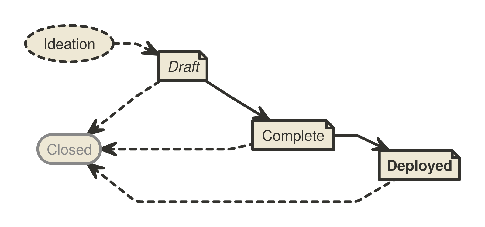

```
BIP: ?
Title: Updated BIP Process
Author: Murch <murch@murch.one>
Comments-URI: https://github.com/bitcoin/bips/wiki/Comments:BIP-Updated-BIP-Process
Status: Draft
Type: Process
Created: 2024-05-13
License: BSD-2-Clause
Post-History: https://github.com/murchandamus/bips/pull/2
Requires: 123
Replaces: 2
```

## Abstract

This _Bitcoin Improvement Proposal (BIP)_ provides information about the preparation of BIPs and policies relating to
the publication of BIPs. It replaces [BIP 2](bip-0002.mediawiki) with a streamlined process, and may be amended to address the
evolving needs of the BIP process.

## Motivation

BIP 2 is over eight years old and was written when different concerns were pressing to the bitcoin[^capitalization] community. The BIP
process as defined by BIP 2 thus far seems to have been fashioned to facilitate the design and activation of protocol changes. In the past years, BIPs
more often describe interoperable features beyond the base protocol. The community has had multiple debates about the role of
BIP Editors, and some aspects of the process specified by BIP 2 that did not seem to achieve the intended goals. This
proposal sunsets aspects of the BIP 2 process that did not achieve broad adoption, reduces the judgment calls assigned
to the BIP Editor role, and delineates the BIP Types more expediently.

## Fundamentals

### What is a BIP?

BIPs cover the range of interests of the bitcoin community. The main topic is technology that supports the bitcoin
currency. Most BIPs provide a concise, self-contained, technical description of one new concept, feature, or standard.
Some BIPs describe processes, implementation guidelines, best practices, incident reports (e.g.
[BIP 50](bip-0050.mediawiki)), or other information relevant to the bitcoin community. However, any topics related to
the bitcoin protocol, bitcoin’s peer-to-peer network, and bitcoin client software may be acceptable.

BIPs are intended to be the primary mechanism for proposing new protocol features, coordinating client standards, and
documenting design decisions that have gone into implementations. BIPs may be submitted by anyone.

### BIP Ownership

Each BIP is primarily owned by its authors and represents the authors’ opinion or recommendation. The authors are
expected to foster discussion, address feedback and dissenting opinions, and, if applicable, advance the adoption of
their proposal within the bitcoin community.

#### Authors and Shepherds

Authors may want additional support with the BIP process after writing an initial draft. In that case, they may assign
one or more Shepherds to their BIP. Shepherds are stand-in owners of a BIP who were not involved in writing the
document. They support the authors in advancing the proposal, or act as point-of-contact for the BIP in absence of the
authors. A shepherds may perform the role of an Author for any aspect of the BIP process unless overruled by an Author.
Shepherds share ownership of the BIP at the discretion of the Authors.

### What is the significance of BIPs?

BIPs do not define what bitcoin is: individual BIPs do not represent bitcoin community consensus or a general
recommendation for implementation. A BIP represents a personal recommendation by the BIP authors to the bitcoin
community. Some BIPs may never be adopted. Some BIPs may be adopted by one or more bitcoin clients or other related
software. Some may even end up changing the consensus rules that the bitcoin ecosystem jointly enforces.

### What is the purpose of the BIP repository?

The [BIP repository](https://github.com/bitcoin/bips/) serves as a publication medium and archive for mature proposals. Through its high visibility, it
facilitates the community-wide consideration of BIPs and provides a well-established source to retrieve the latest version of
any BIP. The repository records all changes to each BIP transparently and allows any community member to easily retain a
complete copy of the archive.

The BIP repository is not a tool to track acceptance[^acceptance], adoption, or community consensus on BIPs, beyond
providing a brief overview of BIP statuses (see [Workflow](#workflow) below) to the audience.

### What is the scope of the BIP repository?

The BIP repository is focused on information and technologies that aim to support and expand the utility of the bitcoin
currency. Related topics that are of interest to the bitcoin community may be acceptable. The scope of the BIP
repository is limited to BIPs that do not oppose the fundamental principle that bitcoin constitutes a peer-to-peer
electronic cash system for the bitcoin currency.

## BIP format and structure

### Specification

BIPs should be written in mediawiki or markdown[^markdown] format.

Each BIP must have a _Preamble_, an _Abstract_, and a _Copyright_ section. Authors should
consider all issues in the following list and address each as appropriate. For some BIPs, some concerns may not warrant
a dedicated section.

* Preamble -- Headers containing metadata about the BIP (see the section [BIP header preamble](#bip-header-preamble)
  below).
* Abstract -- A short description of the technical issue being addressed.
* Motivation -- The motivation is critical for BIPs. It should clearly explain what issue the BIP addresses, and how the
  existing situation is inadequate to address the problem that the BIP solves.
* Specification -- The technical specification should describe the syntax and semantics of any new feature. The
  specification should be detailed enough to enable any bitcoin project to create an interoperable implementation.
* Rationale -- The rationale fleshes out the specification by describing what motivated the design and why particular
  design decisions were made. It should describe related work and alternate designs that were considered. The rationale
  should record relevant objections or important concerns that were raised and addressed as this proposal was developed.
* Backward compatibility -- A section describing any backwards incompatibilities, their severity, and instructions
  how implementers/users should deal with these incompatibilities.
* Reference implementation -- Where applicable, a reference implementation, test vectors, and documentation must be
  finished before the BIP can be given the status "Complete". Any or all of these can be provided either in the BIP or as
  auxiliary files (see [Auxiliary Files](#auxiliary-files)).
* Changelog -- A section to track modifications to a BIP after reaching Complete status.
* Copyright -- The BIP must be placed under an acceptable license (see [BIP Licensing](#bip-licensing) below).

#### BIP header preamble

Each BIP must begin with an [RFC 822-style header preamble](https://www.w3.org/Protocols/rfc822/). The headers must appear in the following order. Headers
marked with "\*" are optional. All other headers are required. The overview is followed by an explanation for each header.

```
  BIP: <BIP number, or "?" before assignment>
* Layer: <Consensus (soft fork) | Consensus (hard fork) | Peer Services | API/RPC | Applications>
  Title: <BIP title (≤ 50 characters)>
  Authors: <Authors’ names and email addresses>
* Shepherds: <Shepherds’ names and email addresses>
  Status: <Draft | Complete | Deployed | Closed>
  Type: <Specification | Informational | Process>
  Created: <Date of number assignment (yyyy-mm-dd)>
  License: <Identifier(s) of acceptable license(s)>
* License-Code: <Identifier(s) for Code under different acceptable license(s)>
* Discussion: <Mailing list thread(s), or other noteworthy discussion(s) in "date: URL" format>
* Revision: <Version number (MAJOR.MINOR.PATCH)>
* Requires: <BIP number(s)>
* Replaces: <BIP number>
* Superseded-By: <BIP number>
```

__BIP__: The BIP number, or "?" before a number was assigned. A proposal must not self-assign a BIP number. Numbers are
assigned solely by BIP Editors.

__Layer__: The layer of bitcoin the BIP applies to. See [BIP 123](bip-0123.mediawiki) for
definitions of the various BIP layers.

__Title__: A descriptive title of up to 50 characters.

__Authors__: The authors header lists the names (or pseudonyms) and email addresses of all authors of the BIP.
The format of each authors header value must be

    Random J. User <address@dom.ain>

If there are multiple authors, each should be on a separate line following [RFC
2822](https://datatracker.ietf.org/doc/html/rfc2822.html) continuation line conventions.

__Shepherds__: The Shepherds header lists additional owners of the BIP. Shepherds stand-in for the original authors
of a BIP. The Shepherds header uses the same format as the Authors header. See
the [BIP Ownership](#bip-ownership) section above.

__Status__: The Status header takes one of the four values Draft, Complete, Deployed, and Closed. The
[Workflow](#workflow) section below describes the statuses in detail.

__Type__: The Type header specifies the type of BIP: Specification, Informational, or Process. See the [BIP types](#bip-types) section below.

__Created__: The Created header records the date that the BIP was assigned a number using ISO 8601 (yyyy-mm-dd) format.

__License/License-Code__: The SPDX License Identifier(s) of the acceptable licenses under which this BIP is available.
See the [BIP Licensing](#bip-licensing) section below for a description of the
acceptable Licenses and their SPDX License Identifiers.

If there are multiple licenses, each should be on a separate line.

__Discussion__: The Discussion header is used to point the audience to relevant discussions of the BIP, e.g. the mailing
list thread in which the idea for the BIP was discussed, a thread where a new version of the BIP was presented, or
relevant discussion threads on other platforms. Entries take the format "yyyy-mm-dd: URL", e.g.
`2009-01-09: https://www.mail-archive.com/cryptography@metzdowd.com/msg10142.html`.

Multiple discussions should be listed on separate lines.

__Revision__: The Revision header indicates the version of this BIP after a Changelog section has been added. The value is provided as MAJOR.MINOR.PATCH, e.g. "2.3.1".

__Requires__: BIPs may have a Requires header to indicate existing BIPs the new proposal depends on. If multiple BIPs
are required, they should be listed in one line separated by a comma and space (e.g. "1, 2").

__Replaces/Superseded-By__: BIPs may have a Replaces header that contains the number of an older BIP it renders
obsolete. A Superseded-By header indicates in turn that a BIP has been rendered obsolete by the later document with the
provided number.

#### Auxiliary files

BIPs may include auxiliary files such as diagrams and source code. Auxiliary files must be included in a subdirectory for that BIP named
`bip-XXXX`, where "XXXX" is the BIP number zero-padded to four digits. File names in the subdirectory do not need to adhere to a specific
convention.

### BIP types

* A **Specification BIP** defines a set of technical rules affecting the interoperability of implementations. The
  distinguishing feature of a Specification BIP is that it can be implemented, and implementations can be compliant with
  it. Specification BIPs should come with or refer to a reference implementation and preferably provide test vectors.
* An **Informational BIP** describes a bitcoin design issue, provides general guidelines or other information to the
  bitcoin community.
* A **Process BIP** describes a process surrounding bitcoin, or proposes a change to (or an event in) a process. Process
  BIPs are like Specification BIPs, but apply to topics other than the bitcoin protocol and bitcoin implementations.
  They often require community consensus and are typically binding for the corresponding process. Examples include procedures,
  guidelines, and changes to decision-making processes such as the BIP Process.

## Workflow

The BIP process starts with a new idea for bitcoin. Each potential BIP must have authors
—people who write the BIP, gather feedback, shepherd the discussion in the appropriate forums, and
finally recommend a mature proposal to the community.



### Ideation

After having an idea, the authors should evaluate whether it meets the criteria to become a BIP, as described in
this BIP. The idea must be of interest to the broader community or relevant to multiple software projects. Small
improvements and matters concerning only a single project usually do not require standardization and should instead be
brought up to the relevant project directly.

The authors should first research whether an idea has been considered before. Ideas in bitcoin are often rediscovered,
and prior related discussions may inform the authors what issues may arise in its progression. After some investigation,
the novelty of an idea can be tested by posting about it to the [Bitcoin Development Mailing
List](https://groups.google.com/g/bitcoindev). Prior correspondence can be found in the
[mailing list archive](https://gnusha.org/pi/bitcoindev/).

Vetting an idea publicly before investing the time to formally describe the idea is meant to save both the authors and
the broader community time. Not only may someone point out relevant discussion topics that were missed in the authors’
research, or that an idea is guaranteed to be rejected based on prior discussions, but describing an idea publicly also
tests whether it is of interest to more people besides the authors. After establishing that the idea may be of interest
to the bitcoin community, the authors should work on drafting a BIP.

As a first sketch of the proposal is taking shape, the authors should present it to the [Bitcoin Development Mailing
List](https://groups.google.com/g/bitcoindev). This gives the authors a chance to collect initial feedback and address
fundamental concerns. If the authors wish to work in public on the proposal at this stage, it is recommended that they
open a pull request against one of their forks of the BIP repository instead of the main BIP repository.

It is recommended that complicated proposals be split into separate BIPs that each focus on a specific component of the
overall proposal.

### Progression through BIP Statuses

The following sections refer to BIP Status Field values. The BIP Status Field is defined in the Header Preamble
specification above.

#### Draft

After fleshing out the proposal further and ensuring that it is of high quality and properly formatted, the authors should
open a pull request to the [BIP repository](https://github.com/bitcoin/bips). The document must adhere to the
formatting requirements specified below and should be provided as a file named with a working title of the form "bip-title.[md|mediawiki]". The authors must not
self-assign a number to their proposal.

BIPs that (1) adhere to the formatting requirements, (2) are on-topic, and (3) have materially progressed
beyond the ideation phase, e.g. by generating substantial public discussion and commentary from diverse contributors, by
independent bitcoin projects working on adopting the proposal, or by the authors working for an extended period
toward improving the proposal based on community feedback, will be assigned a number by a BIP editor. The BIP editors
should delay number assignment when they perceive a proposal being met with lack of interest: number
assignment facilitates the distributed discussion of ideas, but before a proposal garners some interest in the bitcoin
community, there is no need to refer to it by a number.

Proposals are also not ready for number assignment if they duplicate efforts, disregard formatting rules, are too
unfocused or too broad, fail to provide proper motivation, fail to address backwards compatibility where necessary, or fail to specify
the feature clearly and comprehensively. Reviewers and BIP editors should provide guidance on how the proposal may
be improved to progress toward readiness. Pull requests that are proposing off-topic or unserious ideas or have
stopped to make progress may be closed.

When the proposal is ready and has been assigned a number, a BIP editor will merge it into the BIP repository.
After the BIP has been merged to the repository, its main focus should no longer shift significantly, even while the authors
may continue to update the proposal as necessary. Updates to merged documents by the authors should also be
submitted as pull requests.

#### Complete[^complete]

When the authors have concluded all planned work on their proposal, are confident that their BIP represents a net improvement, is clear, comprehensive, has a working
reference implementation (if applicable), and is ready for adoption by the bitcoin community, they may update the BIP’s
status to Complete to indicate that they recommend adoption, implementation, or deployment of the BIP. Where applicable, the
authors must ensure that any proposed specification is solid, not unduly complicated, and definitive. Subsequently, the
BIP’s content should only be adjusted in minor details, e.g. to improve language, clarify ambiguities, backfill
omissions in the specification, add test vectors for edge cases, or address other issues discovered as the BIP is being
adopted.

A Complete BIP can only move to Deployed or Closed. Any necessary changes to the specification should be
minimal and interfere as little as possible with ongoing adoption. If a Complete BIP is found to need
substantial functional changes, it may be preferable to move it to Closed[^new-BIP], and to start a new BIP with the changes
instead. Otherwise, it could cause confusion as to what being compliant with the BIP means.

Complete is the final state for most successful Informational BIPs.

#### Deployed

A settled[^settled] BIP may be advanced to Deployed upon request by
any community member with evidence that the idea described in the BIP is in active use. Such evidence includes
for example: at least one project having deployed support for the BIP in mainnet software releases, a soft fork
proposal’s activation criteria having been met on the network, or rough consensus for the BIP having been demonstrated.

At that point, the BIP should be considered final and any breaking changes to the BIP should be proposed as a new
separate BIP.[^new-BIP]

##### Process BIPs

A Process BIP may change status from Complete to Deployed when it achieves rough consensus on the mailing list. Such a
proposal is said to have rough consensus if it has been open to discussion on the development mailing list for at least
one month, and no person maintains any unaddressed substantiated objections to it. Addressed or obstructive objections
may be ignored/overruled by general agreement that they have been sufficiently addressed, but clear reasoning must be
given in such circumstances. Deployed Process BIPs may be modified indefinitely as long as a proposed modification
has rough consensus per the same criteria.[^living-documents]

#### Closed[^closed]

A BIP that is _not in active use_, may be labeled Closed when its authors have stopped working on it, no longer
recommend the proposed approach, or no longer pursue adoption of their Complete proposal. The reason for moving the
proposal to Closed should be recorded in the Changelog section in the same commit that updates the status.

##### Draft ↦ Closed

BIP authors may decide on their own to change their BIP’s status from Draft to Closed. If a Draft BIP stops making
progress, sees accumulated feedback unaddressed, or otherwise appears stalled for a year, the community may move the BIP
to Closed unless the authors assert that they intend to continue work when contacted.

##### Complete ↦ Closed

BIPs that had attained the Complete status, i.e. that had been recommended for adoption, may be moved to Closed per
the authors’ announcement to the Bitcoin Development Mailing List after not being opposed within four weeks. To successfully
oppose the move, at least one of the opposers must become BIP author for the BIP to remain Complete. A BIP
can also be moved to Closed by the community if it has had Complete status for at least one year, there is no
evidence of it being in active use, and its authors do not object or fail to respond, unless a new author volunteers
within four weeks.

##### Deployed ↦ Closed

A BIP may evolve from Deployed to Closed when it is no longer in active use. Any community member may initiate this
Status update by announcing it to the mailing list, and proceed if no objections have been raised for four weeks.

##### Closed ↦ Draft

The Closed status is generally intended to be a final status for BIPs.

If BIP authors decide to make another attempt at a previously Closed BIP, it is generally recommended to
create a new proposal. (Obviously, the authors may borrow any amount of inspiration or actual text from any prior BIPs as
licensing permits.) The authors should take special care to address the issues that caused the prior attempt’s
abandonment. Even if the prior attempt had been assigned a number, the new BIP will generally be assigned a distinct
number, unless it is obvious that the new attempt directly continues work on the same idea, in which case it may be
reasonable to return the Closed BIP to Draft status.

### Changelog

To help implementers understand updates to a BIP, any changes after it has reached Complete are tracked with version,
date, and description in a Changelog section. The version number is inspired by semantic versioning (MAJOR.MINOR.PATCH).
The MAJOR version is incremented if changes to the BIP’s Specification are introduced that are incompatible with prior
versions (which should be rare after a BIP is Complete, and only happen in well-grounded exceptional cases to a BIP that
is Deployed). The MINOR version is incremented whenever the specification of the BIP is changed or extended in a
backward-compatible way. The PATCH version is incremented for other changes to the BIP that are noteworthy (bug fixes,
test vectors, important clarifications, etc.). The version should start at 1.0.0 with the date the BIP was promoted to
Complete. An example of a Changelog section can be seen in
[BIP 352](https://github.com/bitcoin/bips/blob/master/bip-0352.mediawiki). After a BIP receives a Changelog, the
Preamble must indicate the latest version in the Revision header.

### Adoption of proposals

The BIP repository does not track the sentiment on proposals and does not track the adoption of BIPs beyond whether
they are in active use or not. It is not intended for BIPs to list additional implementations beyond the reference
implementation: the BIP repository is not a signpost where to find implementations.[^OtherImplementations] After a BIP
is advanced to Complete, it is up to the bitcoin community to evaluate, adopt, ignore, or reject a BIP. Individual
bitcoin projects are encouraged to publish a list of BIPs they implement. A good example of this at the time of writing
this BIP can be observed in [Bitcoin Core’s doc/bips.md
file](https://github.com/bitcoin/bitcoin/blob/master/doc/bips.md).

### Transferring BIP Ownership

It occasionally becomes necessary to transfer ownership of BIPs to new owners. In general, it would be preferable to retain
the original authors of the transferred BIP, but that is up to the original authors. A good reason to
transfer ownership is because the original authors no longer have the time or interest in updating it or following through
with the BIP process, or have fallen off the face of the 'net (i.e. are unreachable or not responding to email). A bad
reason to transfer ownership is because someone doesn't agree with the direction of the BIP. The community tries to build consensus
around a BIP, but if that's not possible, rather than fighting over control, the dissenters should supply a competing
BIP.

If someone is interested in assuming ownership of a BIP, they should send an email asking to take over, addressed to the
original authors, the BIP Editors, and the Bitcoin Development Mailing List. If the authors do not respond in a timely manner (e.g. two weeks), the BIP editors will
make a unilateral decision whether to appoint the applicants as [Shepherds](#authors-and-shepherds) (which may be amended should the original authors make a delayed reappearance).

## BIP Licensing

### Specification

Each new BIP must identify at least one acceptable license in its preamble. Licenses must be referenced per their
respective [SPDX License identifier](https://spdx.org/licenses). New BIPs may be accepted with the licenses described
below.

For example, a preamble might include the following License header:

    License: CC0-1.0
             GNU-All-Permissive

In this case, the BIP text is fully licensed under both the Creative Commons CC0 1.0 Universal license as well as the
GNU All-Permissive License, and anyone may modify and redistribute the text provided they comply with the terms of
*either* license. In other words, the license list is an "OR choice", not an "AND also" requirement.

It is also possible to license source code differently from the BIP text by including the optional License-Code header
after the License header. Again, each license must be referenced by their respective SPDX License identifier shown below.

Each source code file or source directory should specify the license under which it is made available as is common in
software (e.g. with a license header or a LICENSE/COPYING file). It is recommended
to make any test vectors available under CC0-1.0 or GNU-All-Permissive in addition to any other licenses to allow anyone
to copy test vectors into their implementations without introducing license hindrances.
Licenses listed in the License-Code header apply to all source directories, source code files, and test vectors
provided with the BIP except those where a LICENSE file in a directory or the file header states otherwise.

For example, a preamble specifying the optional License-Code header might look like:

    License:         CC0-1.0
    License-Code:    MIT

In this case, the code in the BIP is not available under CC0-1.0, but is only available under the terms of the MIT
License.

BIPs are not required to be *exclusively* licensed under approved terms, and may also be licensed under unacceptable
licenses *in addition to* at least one acceptable license. In this case, only the acceptable license(s) should be listed
in the License and License-Code headers.

It is recommended that BIPs that include literal code be licensed under the same license terms as the project it
modifies. For example, literal code intended for Bitcoin Core would ideally be licensed (or dual-licensed) under the MIT license terms.

In all cases, details of the licensing terms must be provided in the Copyright section of the BIP.

#### Acceptable licenses[^licenses]

* BSD-2-Clause: [OSI-approved BSD 2-clause license](https://opensource.org/licenses/BSD-2-Clause)
* BSD-3-Clause: [OSI-approved BSD 3-clause license](https://opensource.org/licenses/BSD-3-Clause)
* CC0-1.0: [Creative Commons CC0 1.0 Universal](https://creativecommons.org/publicdomain/zero/1.0/)
* GNU-All-Permissive: [GNU All-Permissive License](http://www.gnu.org/prep/maintain/html_node/License-Notices-for-Other-Files.html)
* CC-BY-4.0: [Creative Commons Attribution 4.0 International](https://creativecommons.org/licenses/by/4.0/)
* CC-BY-SA-4.0: [Creative Commons Attribution-ShareAlike 4.0 International](https://creativecommons.org/licenses/by-sa/4.0/)
* MIT: [Expat/MIT/X11 license](https://opensource.org/licenses/MIT)

#### Not acceptable licenses

All licenses not explicitly included in the above lists are not acceptable terms for a Bitcoin Improvement Proposal.
However, BIPs predating the acceptance of this BIP were allowed under other terms, and should use these abbreviations
when no other license is granted:

* PD: Released into the public domain
* OPL: [Open Publication License, version 1.0](http://opencontent.org/openpub/)

## BIP Editors

The current BIP editors are:

* Bryan Bishop ([kanzure@gmail.com](mailto:kanzure@gmail.com))
* Jon Atack ([jon@atack.com](mailto:jon@atack.com))
* Luke Dashjr ([luke_bipeditor@dashjr.org](mailto:luke_bipeditor@dashjr.org))
* Mark "Murch" Erhardt ([murch@murch.one](mailto:murch@murch.one))
* Olaoluwa Osuntokun ([laolu32@gmail.com](mailto:laolu32@gmail.com))
* Ruben Somsen ([rsomsen@gmail.com](mailto:rsomsen@gmail.com))

### BIP Editor Responsibilities & Workflow

The BIP editors subscribe to the Bitcoin Development Mailing List and watch the [BIPs
repository](https://github.com/bitcoin/bips).

When a new BIP idea is submitted to the mailing list, BIP editors and other community members should comment in regard
to:

* Novelty of the idea
* Viability, utility, and relevance of the concept
* Readiness of the proposal
* On-topic for the bitcoin community

Discussion in pull request comments can often be hard to follow as feedback gets marked as resolved
when it is addressed by authors. Substantive discussion of ideas may be more accessible to a broader audience on the
mailing list, where it is also more likely to be retained by the community memory.

If the BIP needs more work, an editor should ensure that constructive, actionable feedback is provided to the authors for
revision. Once the BIP is ready it should be submitted as a "pull request" to the [BIPs
repository](https://github.com/bitcoin/bips) where it may get further feedback.

For each new BIP pull request that comes in, an editor checks the following:

* The idea has been previously discussed on the Bitcoin Development Mailing List
* Title accurately describes the content
* Proposal is of general interest and/or pertains to more than one bitcoin project/implementation
* Document is properly formatted
* Licensing terms are acceptable
* Motivation, Rationale, and Backward Compatibility have been addressed
* Specification provides sufficient detail for implementation
* The defined Layer header must be correctly assigned for the given specification
* The BIP is ready: it is comprehensible, technically feasible, and all aspects are addressed as necessary

Editors do NOT evaluate whether the proposal is likely to be adopted.

A BIP editor will:

* Assign a BIP number and BIP type in the pull request
* Merge the pull request when it is ready
* List the BIP in the [README](README.mediawiki)

The BIP editors are intended to fulfill administrative and editorial responsibilities. The BIP editors monitor BIP
changes, and update BIP headers as appropriate.

BIP editors may also, at their option, unilaterally make and merge strictly editorial changes to BIPs, such as
correcting misspellings, fixing broken links, etc. as long as they do not change the meaning or conflict with the
original intent of the authors. Such a change must be recorded in the Changelog if it’s noteworthy per the criteria
mentioned in the [Changelog](#changelog) section.

## Backward Compatibility

### Changes from BIP 2

- Rename "Author" field to "Authors"
- Refer to the proposers of a BIP as "authors" throughout the document.
- The Standards Track type is superseded by the similar Specification type.[^standard-track]
- Most sections are declared optional, it is up to the authors and audience to judge whether all relevant topics have
  been comprehensively addressed and which topics require a designated section to do so.
- Layer header is optional for Specification BIPs or Informational BIPs, as it does not make sense for all BIPs.[^layer]
- The comment system is abolished. Comments-URI and Comment-Summary headers are dropped from the preamble, Comments as
  an aspect of the process are discontinued.[^comments]
- Process BIPs are living documents that do not ossify and may be modified indefinitely.
- Titles may now be up to 50 characters.
- The Discussions-To header is dropped as it has never been used in any BIP.
- The Post-History header is replaced with the Discussion header.
- The Status field is no longer modeled around the workflow of consensus changes.
- Status field values are reduced from nine to four:
  - Deferred, Obsolete, Rejected, Replaced, and Withdrawn are gathered up into Closed.[^closed]
  - Final and Active are collapsed into Deployed.
  - The remaining statuses are Draft, Complete, Deployed, and Closed.
- BIPs no longer get rejected solely on grounds of not making progress for three years.[^rejection]
- A BIP may be set to Closed by its authors, or by anyone if it appears to have stopped making progress for at least a
  year and its authors do not assert that they are still working on it when contacted.
- Many judgment calls previously required from BIP Editors are reassigned either to the BIP authors or the repository’s
  audience.
- Tracking of adoption, acceptance, and community consensus is out of scope for the BIP repository, except to determine
  whether a BIP is in active use for the move into or out of the Deployed status.
- "Other Implementations" sections are discouraged.[^OtherImplementations]
- Auxiliary files are only permitted in the corresponding BIP’s subdirectory, as no one used the alternative of labeling
  them with the BIP number.
- The set of acceptable licenses was reduced to the ones previously used, and the distinction between recommended and
  acceptable licenses was dropped

### Updates to existing BIPs should this BIP be activated

#### Previous BIP Process

This BIP supersedes BIP 2 as the guideline for the BIP process.

#### BIP types

Standards Track BIPs and eligible Informational BIPs are assigned the Specification type. The Standards Track type is
considered obsolete. Specification BIPs use the Layer header rules specified in [BIP 123](BIP-0123.mediawiki).

#### Comments

The Comments-URI and Comment-Summary headers should be removed from all BIPs whose comment page in the wiki is empty.
For existing BIPs whose comment page has content, BIP Authors may keep both headers or remove both headers at their
discretion. It is recommended that existing wiki pages are not modified due to the activation of this BIP.

#### Status field

After the activation of this BIP, the Status fields of existing BIPs that do not fit the specification in
this BIP are updated to the corresponding values prescribed in this BIP.

#### Authors header

The Author header is replaced with the Authors header in all BIPs.

#### Shepherds header

The optional Shepherds header is introduced to distinguish the original authors of a BIP from later successors.

#### Discussion header

The Post-History header is replaced with the Discussion header in all BIPs.

#### Licenses

The licenses of existing BIPs remain untouched.

## Copyright

This BIP is licensed under the [BSD-2-Clause License](https://opensource.org/licenses/BSD-2-Clause). Some content was
adapted from [BIP 2](BIP-0002.mediawiki) which was also licensed under the BSD-2-Clause.

## Related Work

- [BIP 1: BIP Purpose and Guidelines](bip-0001.mediawiki)
- [BIP 2: BIP Process, revised](BIP-0002.mediawiki)
- [BIP 123: BIP Classification](BIP-0123.mediawiki)
- [RFC 822: Standard for ARPA Internet Text Messages](https://datatracker.ietf.org/doc/html/rfc822)
- [RFC 2223: Instructions to RFC Authors](https://datatracker.ietf.org/doc/html/rfc2223)
- [RFC 7282: On Consensus and Humming in the IETF](https://tools.ietf.org/html/rfc7282)

## Acknowledgements

We thank AJ Towns, Jon Atack, Jonas Nick, Larry Ruane, Pieter Wuille, Tim Ruffing, and others for their review,
feedback, and helpful comments.

## Rationale

[^capitalization]: **When is Bitcoin capitalized and when is it lowercased?**  
    This document refers to the currency and the concept as lowercase bitcoin, and only uses capitalized Bitcoin in
    proper nouns.
[^standard-track]: **Why was the Specification type introduced?**  
    The definitions of Informational and Standards Track BIPs caused some confusion in the past. Due to Informational
    BIPs being described as optional, Standards Track BIPs were sometimes misunderstood to be generally recommended.
    This has led to a number of BIPs that propose new features affecting interoperability of implementations
    being assigned the Informational type. The situation is remedied by introducing a new _Specification BIP_ type that
    is inclusive of any BIPs that can be implemented and affect interoperability of bitcoin applications. Since all BIPs
    are individual recommendations by the authors (even if some may eventually achieve endorsement by the majority of
    the community), the prior reminder that Informational BIPs are optional is dropped.
[^comments]: **Why were comments, Comments-URI, and Comment-Summary removed from the process?**  
    The comments feature saw insignificant adoption. Few BIPs received any comments and barely any more than two with
    only a handful of contributors commenting at all. This led to many situations in which one or two comments ended up
    dominating the comment summary. While some of those comments may have been representative of broadly held opinions, it
    also overstated the importance of individual comments directly in the Preamble of BIPs. As collecting feedback in
    this accessible fashion failed, the new process puts the onus back on the audience to make their own evaluation.
[^layer]: **Why is the layer header now permitted for other BIP types?**  
    The layer header had already been used by many Informational BIPs, so the rule that it is only available to
    Standards Track BIPs is dropped.
[^OtherImplementations]: **What is the issue with "Other Implementations" sections in BIPs?**  
    In the past, some BIPs had "Other Implementations" sections that caused frequent change requests to existing BIPs.
    This put an onus on the BIP authors, and frequently led to lingering pull requests due to the corresponding BIPs’
    authors no longer participating in the process. Many of these alternative implementations eventually became
    unmaintained or were low-quality to begin with. Therefore, "Other Implementations" sections are heavily discouraged.
[^complete]: **Why was the Proposed status renamed to Complete?**  
    Some reviewers of this BIP raised that in a process which outlines the workflow of Bitcoin Improvement _Proposals_
    using "Proposed" as a status field value was overloading the term: clearly _proposals_ are proposed at all stages of
    the process. "Complete" expresses that the authors have concluded planned work on all parts of the proposal and are
    ready to recommend their BIP for adoption. The term "ready" was also considered, but considered too subjective.
[^rejection]: **Why can proposals remain in Draft or Complete indefinitely?**  
    The automatic 3-year timeout of BIPs has led to some disagreement in the past and seems unnecessary in cases where
    the authors are still active in the community and still considers their idea worth pursuing. On the other hand,
    proposals that appear stale may be tested and cleared out after only one year which should achieve the main
    goal of the original rule.
[^closed]: **Why was the Closed Status introduced?**  
    Previously, the process had Deferred, Obsolete, Rejected, Replaced, and Withdrawn which all meant some flavor of "work has
    stopped on this". The many statuses complicated the process, may have contributed to process fatigue, and may have
    resulted in BIPs’ statuses not being maintained well. The author of this BIP feels that all of the aforementioned
    can be represented by _Closed_ without significantly impacting the information quality of the overview table.
    Where the many Status variants provided minuscule additional information, the simplification is more valuable and
    the Changelog section now collects specific details.
[^acceptance]: **Why does the BIP repository no longer track adoption?**  
    BIP 2 made an attempt to gather community feedback into summaries in BIPs directly. Given the low adoption and
    corresponding low information quality of the summaries that resulted from that feature, this BIP instead intends to
    leave the evaluation of BIPs to the audience.
[^markdown]: **Which flavor of markdown is allowed?**  
    The author of this proposal has no opinion on Markdown flavors, but recommends that proposals stick to the basic
    Markdown syntax features commonly shared across Markdown dialects.
[^living-documents]: **Why are Process BIPs living documents?**  
    In the past years, the existing BIPs process has not always provided a clear approach to all situations. For
    example, the content of BIP 2 appears to have been penned especially with fork proposals in mind. It seems clear
    that bitcoin development will evolve in many surprising ways in the future. Instead of mandating the effort of
    writing a new process document every time new situations arise, it seems preferable to allow the
    process to adapt to the concerns of the future in specific aspects. Therefore, Process BIPs are defined as living
    documents that remain open to amendment. If a Process BIP requires large modifications or even a complete
    overhaul, a new BIP should be preferred.
[^new-BIP]: **Why should the specification of an implemented BIP no longer be changed?**  
    After a Complete or Deployed BIP have been deployed by one or more implementations, breaking changes to the
    specification could lead to a situation where multiple "compliant" implementations fail at
    being interoperable, because they implemented different versions of the same BIP. Therefore, even changes to the
    specification of Complete BIPs should be avoided, but Deployed BIPs should never be subject to breaking changes to
    their specification.
[^settled]: **What is meant by a BIP being settled?**  
    Since Deployed BIPs should not be changed, a Complete BIP should only be moved to Deployed after its Specification has
    been put through its paces and changes to the BIP have stopped.
[^licenses]: **Why were some licenses dropped?**  
    Among the 141 BIPs with licenses in the repository, only nine licenses have ever been used to license BIPs (although,
    some BIPs were made available under more than one license) and only one license has been used to license code:

    Licenses used:

    * BSD-2-Clause: 55
    * PD: 42
    * CC0-1.0: 23
    * BSD-3-Clause: 19
    * OPL: 5
    * CC-BY-SA-4.0: 4
    * GNU-All-Permissive: 3
    * MIT: 2
    * CC-BY-4.0: 1

    License-Code used:

    * MIT: 4

    The following previously acceptable licenses have been dropped, because they have never been used in the BIPs process:

    * AGPL-3.0+: [GNU Affero General Public License (AGPL), version 3 or newer](http://www.gnu.org/licenses/agpl-3.0.en.html)
    * Apache-2.0: [Apache License, version 2.0](http://www.apache.org/licenses/LICENSE-2.0)
    * BSL-1.0: [Boost Software License, version 1.0](http://www.boost.org/LICENSE_1_0.txt)
    * FDL-1.3: [GNU Free Documentation License, version 1.3](http://www.gnu.org/licenses/fdl-1.3.en.html)
    * GPL-2.0+: [GNU General Public License (GPL), version 2 or newer](http://www.gnu.org/licenses/old-licenses/gpl-2.0.en.html)
    * LGPL-2.1+: [GNU Lesser General Public License (LGPL), version 2.1 or newer](http://www.gnu.org/licenses/old-licenses/lgpl-2.1.en.html)

    Why are software licenses included?

    * Some BIPs, in particular those concerning the consensus layer, may include literal code in the BIP itself which
      may not be available under the license terms the authors wish to use for the BIP.
    * The author of this BIP has been provided with a learned opinion indicating that software licenses are perfectly acceptable for
      licensing "human code" i.e. text as well as Markdown or Mediawiki code.

    Why are OPL and Public Domain no longer acceptable for new BIPs?

    * Public domain is not universally recognised as a legitimate action, thus it is inadvisable.
    * The OPL is generally regarded as obsolete, and not a license suitable for new publications.
